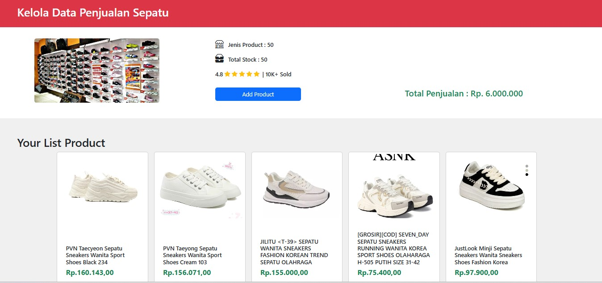

# Project Interview - CRUD Laravel Sederhana

Proyek ini adalah aplikasi CRUD untuk manajemen produk sepatu menggunakan Laravel.
Proyek ini bertujuan untuk memberikan tampilan dan fungsionalitas pengelolaan produk sepatu dalam bentuk aplikasi berbasis web.

## Teknologi yang Digunakan

-   Laravel 8 (PHP)
-   MySQL
-   Bootstrap

## Cara Menjalankan Aplikasi

1. **Clone repositori ini**:
    ```bash
    git clone https://github.com/username/Project-interview-AP.git
    ```
2. **Masuk ke folder proyek**:
    ```bash
    cd Project-interview-AP
    ```
3. **Instal dependensi Laravel**:
    ```bash
    composer install
    ```
4. **Salin file `.env.example` ke `.env`**:
    ```bash
    cp .env.example .env
    ```
5. **Generate key aplikasi Laravel**:
    ```bash
    php artisan key:generate
    ```
6. **Setel konfigurasi database di file `.env`** sesuai dengan pengaturan MySQL lokal Anda.
7. **Jalankan migration untuk membuat tabel di database**:
    ```bash
    php artisan migrate
    ```
8. **Jalankan server Laravel**:
    ```bash
    php artisan serve
    ```

Setelah itu, buka aplikasi di browser Anda pada `http://localhost:8000`.

## Fitur CRUD Sederhana

-   Menambahkan produk sepatu
-   Mengedit produk sepatu
-   Menghapus produk sepatu
-   Menampilkan daftar produk sepatu

## Screenshot



#  Soal No. 1 Data flow Diagram (DFD) Penjualan Sepatu
- [View DFD Level 1 on Google Drive](https://drive.google.com/file/d/1Qlz-nHEXEfpUOCaWnxH42D0ZVpbDoqkV/view?usp=sharing)

